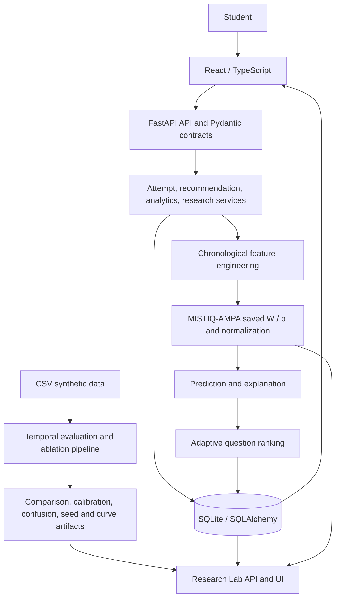

# MISTIQ 2.0

**Mistake Intelligence & Sequential Prediction** is a student practice platform backed by a custom, sequential mistake-category model. MISTIQ-AMPA estimates a learner's next mistake category from recorded attempts and mistakes; adaptive practice, explanations, progress, and mistake summaries use actual application data.

**Research question:** “Can the trajectory of a student's mistakes predict their next conceptual failure better than their overall accuracy?”

> MISTIQ-AMPA is a project-specific custom sequential mistake-prediction framework designed for this project. It is not claimed to be a newly invented universal machine-learning paradigm.

## Problem and approach

Students can benefit from practice selected around patterns in their own work. MISTIQ stores the sequence **Student → Question → Attempt → Mistake**, derives eight history features, and applies saved AMPA global parameters to score candidate mistake categories. The student app presents the result carefully, offers an actual question from the bank, and updates progress after practice.

The project includes a React student app, a FastAPI/SQLAlchemy backend, the explicit NumPy AMPA implementation, scikit-learn comparison baselines, synthetic interaction data, temporal experiment outputs, and a technical Research Lab. Experiment metrics are measurements on the available synthetic dataset, not educational efficacy claims.

## Architecture



The experiments pipeline is separate from online inference. API requests load the saved artifact at application startup; they do not train it. The online student state is kept separate from global learned weights and biases.

## Features

- Student dashboard, question practice, progress, mistakes, and learning profile.
- AMPA mistake-category probabilities, confidence/reliability, and contribution-based explanations.
- History-grounded practice recommendations from the question bank.
- Progress trajectory, topic/difficulty summaries, recovery, repeated mistakes, and observed concept confusion.
- Research / Model Lab, Formula Explorer, and evaluation views for actual model and experiment artifacts.
- Reproducible synthetic data generation and chronological AMPA/baseline evaluation.

## Technology

- Python 3.11+ (tested here with Python 3.14), FastAPI, Pydantic 2, SQLAlchemy 2, NumPy, scikit-learn.
- React 18, TypeScript 5, Vite 5, React Router 6, Vitest 2.
- SQLite is the default local database. Dependency versions are pinned in `backend/requirements.txt`; frontend versions are recorded in `frontend/package-lock.json`.

## Setup

Create an environment and install dependencies:

```powershell
python -m venv .venv
.\.venv\Scripts\Activate.ps1
python -m pip install -r backend\requirements.txt
cd frontend
npm ci
cd ..
```

The AMPA artifact is `backend/ml/artifacts/ampa.npz`. If it is missing, generate the synthetic dataset and train the artifact explicitly:

```powershell
python -m backend.ml.datasets.synthetic_generator --seed 42
python -m scripts.train_ampa_artifact --seed 42
```

Start the API and frontend together from the repository root:

```powershell
npm run dev:all
```

The API runs `python -m uvicorn app.main:app --app-dir backend --reload` on `http://127.0.0.1:8000` and the Vite dev server on its default port; both stop together with `Ctrl+C`. You can also run them in separate terminals from `backend/` and `frontend/`. The default SQLite database is always `backend/mistiq.db`, independent of the current directory.

The Vite development server proxies `/api` to `http://127.0.0.1:8000`. Configure `VITE_API_URL` in `frontend/.env` when using another API URL. Backend settings use process environment variables; `.env.example` lists names and safe local defaults but is not automatically loaded by the backend.

The database needs question rows before the student Practice page can load questions. For an interactive disposable database, generate the synthetic CSV dataset from the repository root, then run `python ..\scripts\seed_question_bank.py` from `backend/` with `DATABASE_URL=sqlite:///./demo.db`. The seed script only accepts an empty question bank. See [demo guide](docs/demo-guide.md) for the full browser setup and reset instructions.

The isolated demonstration seeds synthetic questions into an in-memory SQLite database and exercises the actual API/model without polluting a persistent database:

```powershell
python scripts/demo.py
```

See [demo guide](docs/demo-guide.md) for the complete demonstration flow. The development profile screen is not authentication; do not expose this project or its research APIs to real student data without an authorization layer.

## ML pipeline and evaluation

The interaction dataset is defined in `backend/ml/datasets/schema.py`; the generator supports configurable sizes and a reproducible seed. AMPA builds class-specific rows from strictly prior student interactions, applies training-split-only normalization, and uses stable softmax scores. See [AMPA implementation](docs/mistiq-ampa.md) and [evaluation methodology](docs/evaluation.md).

Re-run the Phase 4 multi-seed comparison, ablations, calibration, cold-start checks, and learning curves from the repository root:

```powershell
python -m experiments.run_evaluation --seed 42 123 --epochs 100
```

Results are written beneath `experiments/`; they are generated artifacts and can be regenerated. Evaluation does not retrain or overwrite the API's AMPA artifact.

## API and Research Lab

Backend health is available at `/health`; OpenAPI docs are at `/docs`. Main API resources use the `/api` prefix. Research routes are under `/api/research`, while the student research pages are `/research`, `/research/formula-explorer`, and `/research/analytics`. Research parameter and student trace endpoints are not protected by roles in this development project.

## College Showcase

The project ships with a local demo learner (`Student ID 1`) built from real question, attempt, feature, prediction, and recommendation records in `backend/mistiq.db`. To see a fully populated profile before creating your own:

- Open the running app and reconnect with Student ID 1 (**Continue**), or
- From the Research Lab → **Database**, use **Seed demo session** to create it on demand and **Reset demo history** to clear it.

You can also prepare it from the command line with `python scripts/setup_showcase.py` and clear it with `python scripts/reset_showcase.py`. Walk through Dashboard → Practice → Mistakes/Progress → Research → Formula Explorer → Evaluation. See the [viva cheatsheet](docs/viva-cheatsheet.md) for project Q&A and the [demo guide](docs/demo-guide.md) for the in-memory end-to-end flow.

## Tests

```powershell
python -m pytest tests -q -p no:cacheprovider
cd frontend
npm test
npm run build
```

## Project structure

```text
backend/app/       FastAPI routes, schemas, services, database models
backend/ml/        AMPA, datasets, baselines, evaluation
frontend/src/      React student and research pages
data/synthetic/    Generated, ignored CSV interaction dataset
experiments/       Reproducible result artifacts and runner
scripts/           Artifact trainer, question-bank seed, and isolated end-to-end demo
tests/             ML, API, database, analytics, and research tests
docs/              Architecture, methods, setup, research and demo guides
```

## Limitations and academic honesty

The available student interactions and checked-in evaluation outputs are synthetic. Synthetic results do not establish performance with real learners. AMPA is a project-specific framework; its predictive and recommendation signals are not causal explanations or psychological assessments. There is no authentication/role authorization, no privacy/deployment hardening, and no production database migration service beyond the SQLite compatibility migrations. Older stored predictions from before Phase 9 may not contain exact formula snapshots. Read the limitations in the phase-specific documentation before interpreting results.
