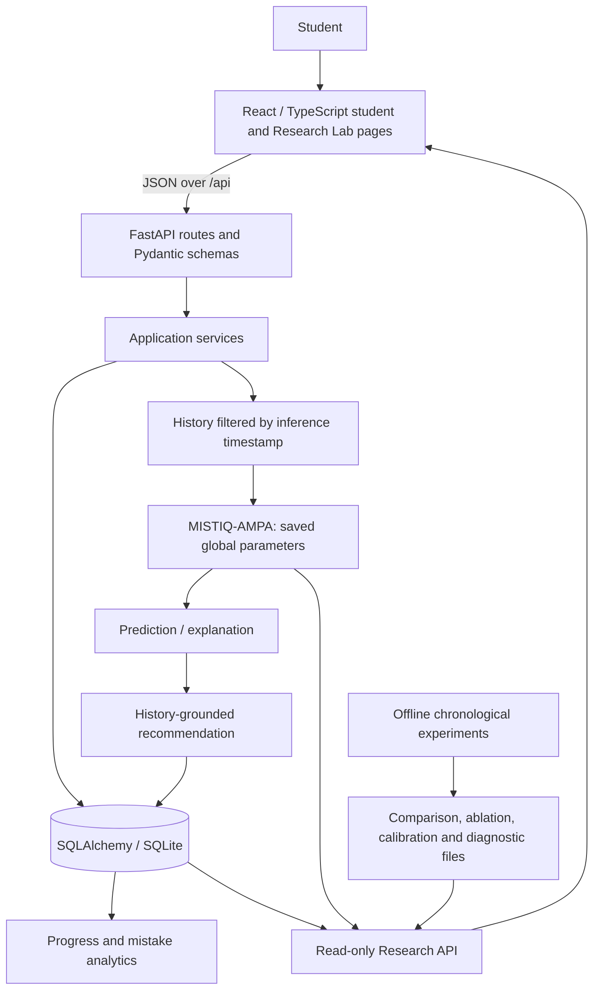

# MISTIQ system architecture

## Runtime responsibilities

- **Frontend:** student practice and analytics pages plus a separate technical Research Lab. It does not determine correctness or calculate predictions.
- **FastAPI boundary:** validates requests/responses, applies structured integration error codes, and depends on SQLAlchemy sessions and the initialized AMPA service.
- **Application services:** transactionally coordinate attempt, mistake, learner state, prediction/explanation, recommendation completion, progress, and mistake intelligence.
- **Database:** persists student, question, attempt, mistake event, learner state, prediction, and recommendation records. SQLite foreign keys are enabled.
- **Feature pipeline:** builds eight candidate-class feature rows from one student's chronological interactions strictly before the inference timestamp. It does not read future attempts or future mistake labels.
- **MISTIQ-AMPA:** loads the saved versioned artifact once at application startup. Global `W`, `b`, and training normalization are distinct from the in-memory per-student interaction history. Online attempts update history but do not retrain the global model.
- **Offline experiments:** read the synthetic CSVs, construct chronological next-mistake examples, split them by time, fit AMPA/baselines on the training partition, and write result artifacts. They are not run by the request path.
- **Research API:** reads the saved model, persisted prediction snapshots, and Phase 4 files. It does not train a model or fabricate unavailable results.

## Development boundaries

The login/profile route is a local development profile, not authentication. Research routes expose global model parameters and student-linked traces without role-based authorization. Use only non-sensitive demo data until an access-control layer is added. The default database URL is relative to the process working directory; run the API from `backend/` when using the checked-in development database location.
